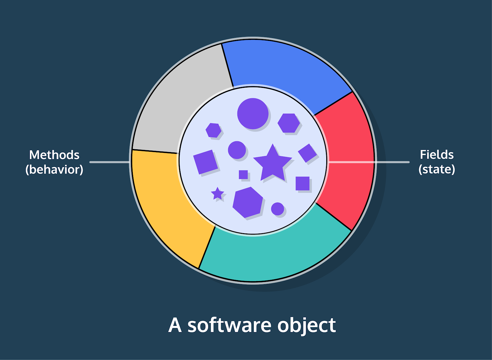
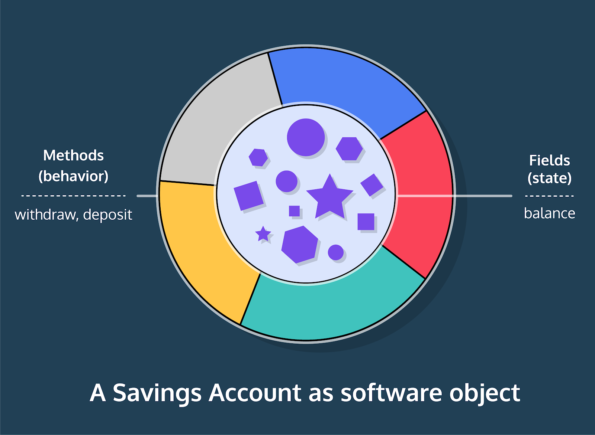

# Classes
All programs require one or more classes that act as a model for the world. 
For example, a program to track student test scores might have Student, Course, and Grade classes. Our real-world concerns, students and their grades, are inside the program as classes.
We represent each student as an **instance, or object,** of the Student class.
This is **object-oriented programming because programs are built around objects and their interactions. An object contains state and behavior.**

**Classes are a blueprint for objects.** Blueprints detail the general structure. For example, all students have an ID, all courses can enroll a student, etc.
An **instance** is the thing itself. This student has an ID of 42, this course enrolled that student, etc.


# Classes: Syntax
The fundamental concept of object-oriented programming is the class.
A class is the set of instructions that describe how an instance can behave and what information it contains.
Java has pre-defined classes such as System, which we’ve used in logging text to our screen, but we also need to write our own classes for the custom needs of a program.
```
public class Car {
// scope of Car class starts after curly brace

  public static void main(String[] args) {
    // scope of main() starts after curly brace

    // program tasks

  }
  // scope of main() ends after curly brace

}
```
// scope of Car class ends after curly brace
This example defines a class named Car. public is an access level modifier that allows other classes to interact with this class. For now, all classes will be public.
This class has a main() method, which lists the tasks performed by the program. main() runs when we execute the compiled Car.class file.

# Classes: Constructors
We create objects (instances of a class) using a constructor method. The constructor is defined within the class.
Here’s the Car class with a constructor:
```
public class Car {
  public Car() {
  //constructor method starts after curly brace

    //instructions for creating a Car instance

  }
  //constructor method ends after curly brace

  public static void main(String[] args) {

    // program tasks

  }
}
```
The constructor, Car(), shares a name with the class.
We create instances by calling or invoking the constructor within main().

This example assigns an instance to the variable ferrari:
```
public class Car {

  public Car() {
  }

  public static void main(String[] args) {
    /*
    invoke a constructor using 
    'new', the name, and parentheses:
    new Car()
    */
    Car ferrari = new Car(); 
  }
}
```

Variables that reference an instance have a type of the class name.
We invoke the constructor method: Car(), and use the keyword new to indicate that we’re creating an instance. Omitting new causes an error.
This is the first time we’ve called a method that we’ve also defined. main() is run automatically and we did not define the println() method.

```
public class Store {
  
  // new method: constructor!
  public Store() {
    System.out.println("I am inside the constructor method.");
  }
  
  // main method is where we create instances!
  public static void main(String[] args) {
    System.out.println("Start of the main method.");
    
    // create the instance below
    Store lemonadeStand = new Store();
    
    // print the instance below
    System.out.println(lemonadeStand);
  }
}
```

# Classes: Instance Fields
Our last exercise ended with printing an instance of Store, which looked something like Store@6bc7c054. The first part, Store, refers to the class, and the second part @6bc7c054 refers to the instance’s location in the computer’s memory.
We don’t care about memory location, but our instances have no other characteristics!
We’ll add associated data to an object by introducing instance variables, or instance fields. Instance fields are the state in our objects.

```
public class Car {
  /*
  declare fields inside the class
  by specifying the type and name
  */
  String color;

  public Car() {
    /* 
    instance fields available in
    scope of constructor method
    */
  }

  public static void main(String[] args) {
    // body of main method
  }
}
```

The declaration is within the class and the instance variable will be available for assignment inside the constructor.
Fields are a type of state each instance will possess. 

```
public class Store {
  // declare instance fields here!
  String productType;
  
  // constructor method
  public Store() {
    System.out.println("I am inside the constructor method.");
  }
  
  // main method
  public static void main(String[] args) {
    System.out.println("This code is inside the main method.");
    
    Store lemonadeStand = new Store();
    
    System.out.println(lemonadeStand);
  }
}
```

# Classes: Constructor Parameters
```
public class Car {
  String color;

  // constructor method with a parameter
  public Car(String carColor) {
    // parameter value assigned to the field
    color = carColor;
  }
  public static void main(String[] args) {
    // program tasks
  }
}
```
Parameters specify the type and name of data available for reference within a method’s scope.
We’ve already seen a parameter in the main() method: String[] args, but this is the first time we’re using the parameter value within a method body.
The parameter carColor references the value passed in during a method call:
new Car("blue");
// carColor references "blue" inside constructor
new Car("yellow");
// carColor references "yellow" inside constructor
Within the constructor, we assign the parameter value to the instance field.
Instance fields are available for assignment inside the constructor because we declared them within the class.

# Classes" Assign Variables to Instance Fields
Here we create an instance, ferrari, in the main()method with "red" as its color field:
```
public class Car {
  String color;

  public Car(String carColor) {
    // assign parameter value to instance field
    color = carColor;
  }

  public static void main(String[] args) {
    // parameter value supplied when calling constructor
    Car ferrari = new Car("red");
  }
}
```
We pass the String value "red" to our constructor method call: new Car("red");.
The type of the value given to the invocation must match the type declared by the parameter.
The object, ferrari, holds the state of color as an instance field referencing the value "red".
We access the value of this field with the dot operator(.):
```
/*
accessing a field:
objectName.fieldName
*/

ferrari.color;
// "red"
```

# Classes: Multiple Fields
Objects are not limited to a single instance field. We can declare as many fields as are necessary for the requirements of our program.
```
public class Car {
  String color;
  // new fields!
  boolean isRunning;
  int velocity;

  // new parameters that correspond to the new fields
  public Car(String carColor, boolean carRunning, int milesPerHour) {
    color = carColor;
    // assign new parameters to the new fields
    isRunning = carRunning;
    velocity = milesPerHour;
  }

  public static void main(String[] args) {
    // new values passed into the method call
    Car ferrari = new Car("red", true, 27);
    Car renault = new Car("blue", false, 70);

    renault.isRunning;
    // false
    ferrari.velocity;
    // 27
  }
}
```
The constructor now has multiple parameters to receive values for the new fields. We still specify the type as well as the name for each parameter.
Ordering matters! We must pass values into the constructor invocation in the same order that they’re listed in the parameters.
```
// values match types, no error
Car honda = new Car("green", false, 0);

// values do not match types, error!
Car junker = new Car(true, 42, "brown");
```
