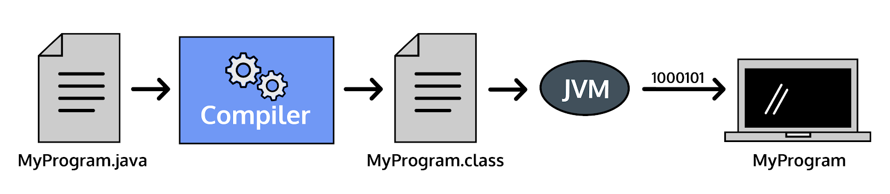

# Compilation
Compilation causes errors. Java is a **compiled programming language**, meaning the code we write in a .java file is transformed into byte code by a compiler before it is executed by the Java Virtual Machine on your computer.

Steps of Java Compilation

A **compiler** is a program that translates human-friendly programming languages into other programming languages that computers can execute.
For example, with a file called Plankton.java, we could compile it with the terminal command:
`javac Plankton.java`
A successful compilation produces a .class file: Plankton.class, that we execute with the terminal command:
java Plankton
An unsuccessful compilation produces a list of errors. No .class file is made until the errors are corrected and the compile command is run again.

#Variables
We store information in variables, named locations in memory.
Naming a piece of information allows us to use that name later, accessing the information we stored.
Variables also give context and meaning to the data we’re storing. 
In Java, we specify the type of information we’re storing. Primitive datatypes are types of data built-in to the Java system.
We must declare a variable to reference it within our program. Declaring a variable requires that we specify the type and name:
// datatype variableName
int age;
double salaryRequirement;
boolean isEmployed;

ints hold positive numbers, negative numbers, and zero. They do not store fractions or numbers with decimals in them.
The int data type allows values between -2,147,483,648 and 2,147,483,647, inclusive.
To declare a variable of type int, we use the intkeyword before the variable name:
// int variable declaration
int yearJavaWasCreated;
// assignment
yearJavaWasCreated = 1996;
